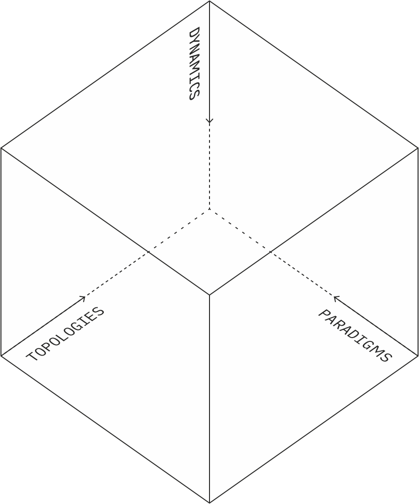
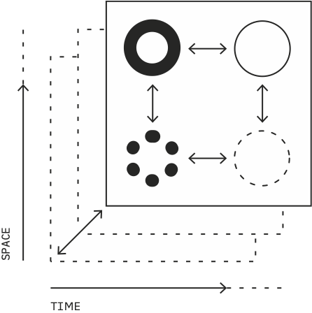
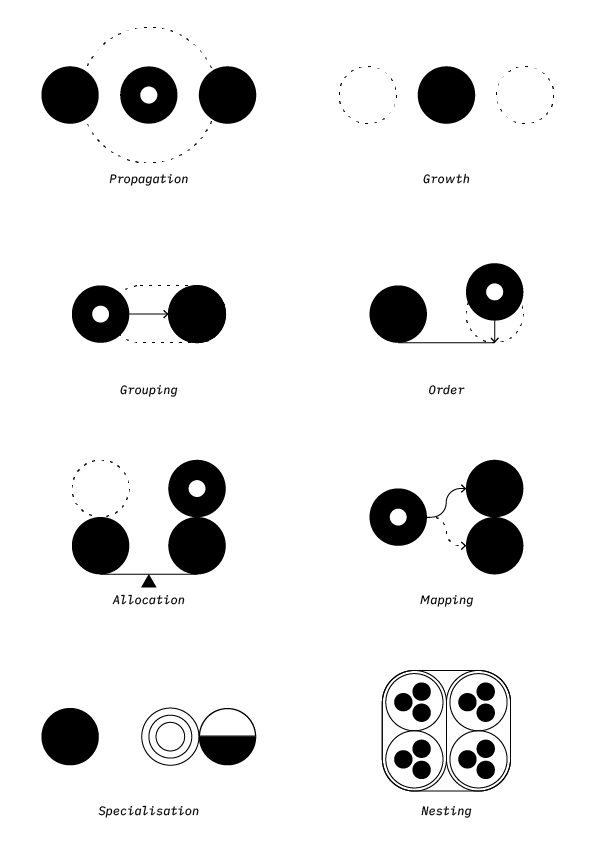

This is a removed portion of my thesis, but as it contains interesting perspectives I decided to upload it here. You can read more about the thesis [here](/thesis).

## Vocabulary of systems modelling for games: Topologies, Dynamics and Paradigms
### Intro to systems vocabulary
To help understand the discussion on systems modeling and on the rest of the thesis, it might be helpful to gather some vocabulary on how systems and their parts can be spoken of. I will use this language throughout the rest of the thesis.

The following framework for describing system models was given in a presentation in 2003 by the famed game designer Will Wright, creator of the Sims, SimCity and Spore. (Wright[^1]) The framework describes system modeling from the point of view of game design, but it's useful language to think about system modeling in a larger context. This is only one way to describe elements within a system, but I find this one particularly useful as it is easy to follow.

### System models can be described with the combination of topologies, dynamics and paradigms
Wright states that system models try to condense the innumerable variables of real systems into an analysable whole, without sacrificing any necessary portions that make the system work. Their point is to communicate ideas about the system. Their level of detail is then largely determined by what is tried to be communicated. They can be used to precisely measure simulated phenomena, but they can just as easily be used to communicate systemic phenomena on a very surface level to kindergarteners.

To talk about the different components of systems modeling, Wright outlines one such language that describes the units or topologies of the system, that are differentiated by their maluability; dynamics of the system, that describe the action that takes place in the system through topologies; and paradigms, which are the different historic lenses through which systems have been attempted to be modelled and which describe a set of tools to achieve a particular type of systems model. These paradigms essentially map topologies to dynamics. These are all elements that are modular and can be rearranged and grouped in various configurations to achieve wanted results. Figure 1 illustrates how each facet is part of the same whole.

 ↑ Figure 1. 

### Topologies describe system units at different scales and rigidities
Wright explains that topologies are the things of which systems are made out of. They describe structures and their interconnectedness thourgh space or time. They may not then necessarily describe any physical manifestation but rather the space that can be occupied by the physical structures.

They consist of agents, networks and layers. Agents in game simulations refer to individual units that make decisions on their own based on their current and past behaviour and end goal. Networks refer to the interconnected web of things that agents can traverse. Layers are rigid structures that create a basis for networks and agents to exist on.

They all contain properties, representing each individual's current state, and representing how they react to stimulus. All these topologies can be represented statistically as their properties only describe their behaviour.

One differentiating factor between them is their rigidity. Agents are the most flexible, as they can change their state very rapidly, whereas layers stay relatively still. This determines how quickly various dynamics affect them.

In games, topologies can be used for example to visualise the branching of possiblity spaces, networks among players or game objects, or interactions between various subsystems.

Furthermore, the actions these topologies do can be described with dynamics.

 ↑ Figure 2. 

#### Dynamics describe flow of topologies
If topologies are nouns, dynamics are verbs.

Wright next outlines vocabulary to describe system dynamics. Dynamics are action happening as a function of time. Dynamics are about rate of change. Things can change linearly, or with exponential or logarithmic trajectories depending on the situation. Things may occur in spatial or temporal patterns. These patterns may have an amplitude and other properties of cyclical action. Dyanmics may change direction, or appear or disappear completely.

**Growth** can happen in many forms. In agents the growth can mean size or number of agents. In networks this can mean the number of connections or the number of nodes. In layers this can mean spatial growth or saturation. **Propagation** is an attribute of information transfer between topologies. Information can propagate through systems in various ways, be it through contact, or via networks. **Grouping** can be thought of as clustering based on similarities. Agents can cluster together, or separate networks can fuse. Often there is competition or friction between groups and their borders. There is a form of communication and control within the group as well as outside of it. This can be for example military units, institutions or nations. When a cluster of agents groups, they achieve a unity where they can be treated as a single unit, essentially, in Wright's words, jumping up a level. **Specialisation** means topologies become focused on individual properties, away from similarity with others. This might also be driven by competition, while a topology is trying to find a niche where to out-thrive others. This can also drive specialised topologies into grouping, which has added benefits for specialised topologies, such as more energy-efficient operations due to cut on task-switching costs among other things. Specialisation also breeds networks, since specialised topologies now need other tasks to be handled by some other topology. Communication drives specialisation. **Allocation** is resource management and proportionality. This is closely related to scarcity, since some resources such as time are always scarce, and need to be allocated carefully. A specialised network of agents may allocate resources depending on the threat or opportunity presented into respective regions of the network. **Mapping** is creation of temporary networks across topologies to achieve an outcome. Mapping can relate to decision-making processes, when considering alternatives. **Nesting** is emergence. When these dynamics work together in a complex way, they build larger and larger sets of topologies and create emergent behaviour, that was not present in the components of the system, similarly as Meadows[^2] talked about with complexity.

 ↑ Figure 3. 

### References

[^1]: Will Wright (2003)
[^2]: Donella Meadows (2008)