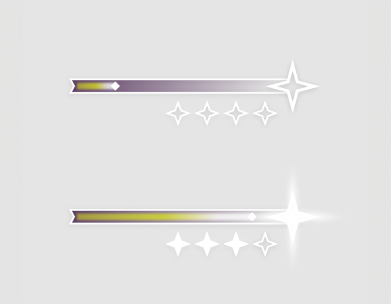
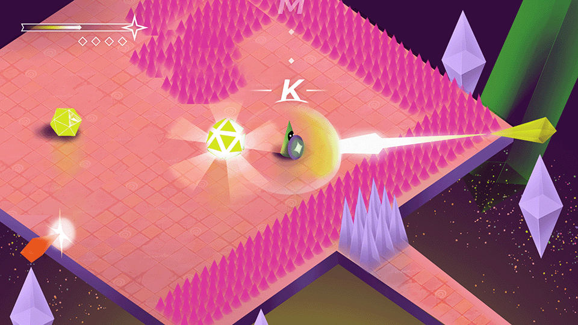
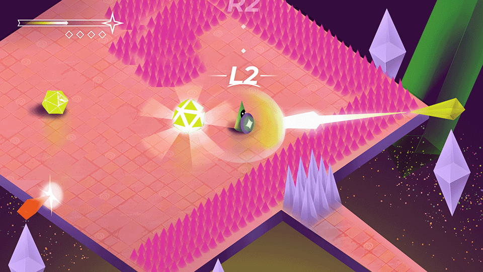
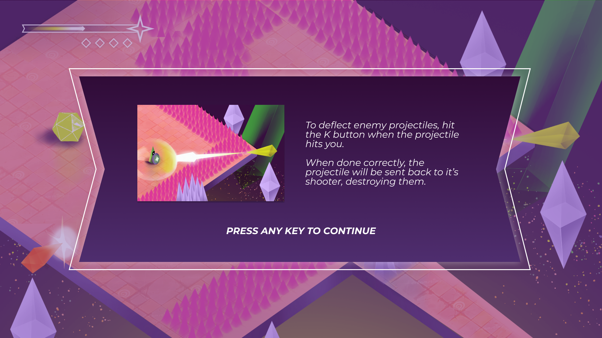

In 2022 I was a part of a 6-member team creating Discordant, a rythm-based bullet hell game. The game was developed over the course of three months as a part of a game project course in Aalto University.

## User Interface

### Indicating progression

This game first and foremost tested the player’s reactions and ability to stay on rythm. This made the core gameplay very heavy on cognitive load. To indicate progress during this type of gameplay, I wanted to stay rather traditional with a progress bar. 

The first difficult task in this was that we had decided that any progress made in the game was tied into how many successful parries you were able to make. To parry, you needed to press the correct button prompt at the right time, and possibly also facing the right direction. We had also decided to tie player health into the number of successful parries. We called this “charge” which was indicated with the bar. If the charge runs out, you die. If you fill it up until the star icon, you progress to the next stage in difficulty. We then needed to also indicate how many jumps in difficulty the player should expect before the arena is over. This was done with the smaller star icons under the main bar.

### Telegraphing attacks

To indicate incoming enemy attacks, I also wanted to borrow from conventions. Arrow indicated where the attacks were coming from, and how many beats it would be until the next attack. These first floated around the screen, but I decided to bring them closer to the player, revolrving around them, because this was the place most players had the capacity to look at during the intense gameplay. I also used color to indicate the type of attack that was coming, which also corresponded with the actual color of the enemy. This was important as the orange attack required the player to be facing towards the attacker when parrying.

## Tutorialisation

### Combat tutorials
As the gameplay was highly tied into the beat of the music, we wanted to make that clearer by providing an onscreen button prompt in the early game. In the MVP we had only a button appearing on screen when the player was supposed to press it, but in the playtesting it was noticed to be too jarring. Instead, we did a countdown-style indicator, that would drop empty beats and the button prompts from the top of the screen on top of the player.

### Pop-up tutorials

## Art Direction

As this was a school project, not everyone in our project had the same level of expeirence in game development. To enable consistency in style, we decided to go in a more low poly, geometric direction with the shape language. In terms of colours, the themes of the story revolved around a trancendental experience, so bright colours suited that need. To highlight relevant UI information, they were exclusively using white in contrast to the rest of the game.

 ↑ Concept art from later in development. At this point in the project we had explored a lot of different art styles, but it turned out we were unable to make them work consistently across artists in the team. This image acted as a master image, based on which everything else needed to be calibrated on. This image also created the basis for the more diagetic UI elements, such as the enemy attack visuals and color coordination between various types of items. 

