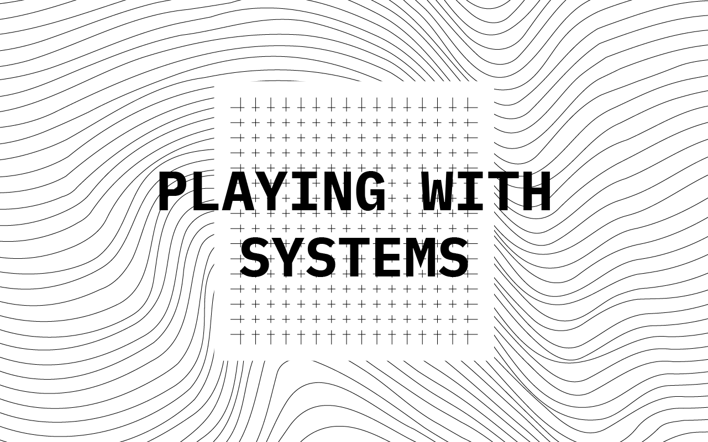

**“Playing with Systems – Reflections on Designing Meaningful Learning Game Experiences”** is my graduate thesis written for Aalto University’s Collaborative and Industrial Design major in 2023. 

## Abstract

Global problems are largely systemic in nature. Fixing systems is often close to impossible, because they are resilient to change and actual solutions are often counterintuitive and hard to pinpoint due to their complexity. The world needs people with the understanding and tools to effectively redesign these systems.

First part of this thesis presents the concept of systems learning games, whose purpose is to train players to understand and operate within complex systems. Systems learning games are games modeled to represent real-world systems, enabling players to experience systemic problems and the act of solving them first-hand in a controlled and abstracted setting. Optimally they focus not only on passing on knowledge, but also on supporting the development of right kinds of skills, character and meta-learning required to solve systemic problems in the real world.

While such systems learning games already exist, they largely ignore player-created meaning, that is often at the core of successful game experiences. The second part reflects on systems learning game prototypes I designed to try and implement gameplay that is simultaniously meaningful to the players and that allows players to achieve set learning goals. These reflections revolve around two central themes: arguments and complexity.

To achieve meaningful gameplay, learning goals can be converted into arguments. They are statements that are meaningful in the context of playing the game and the game world. These statements can be mapped to actual game mechanics using the Mechanics-Dynamics-Aesthetics framework. (Hunicke, 2004) The implementation of the arguments can also happen through worldbuilding, goals, theme or tone of the game.

In the context of modeling real-world systems to games, meaningful gameplay can also be achieved by honing in the right level of complexity. Game systems should be sufficiently complex to generate meaningful decision-making but simple enough in terms of the amount of detail to be maluable and understandable by the players.

<a href="https://aaltodoc.aalto.fi/handle/123456789/121489" target="_blank">Read thesis here →</a>
