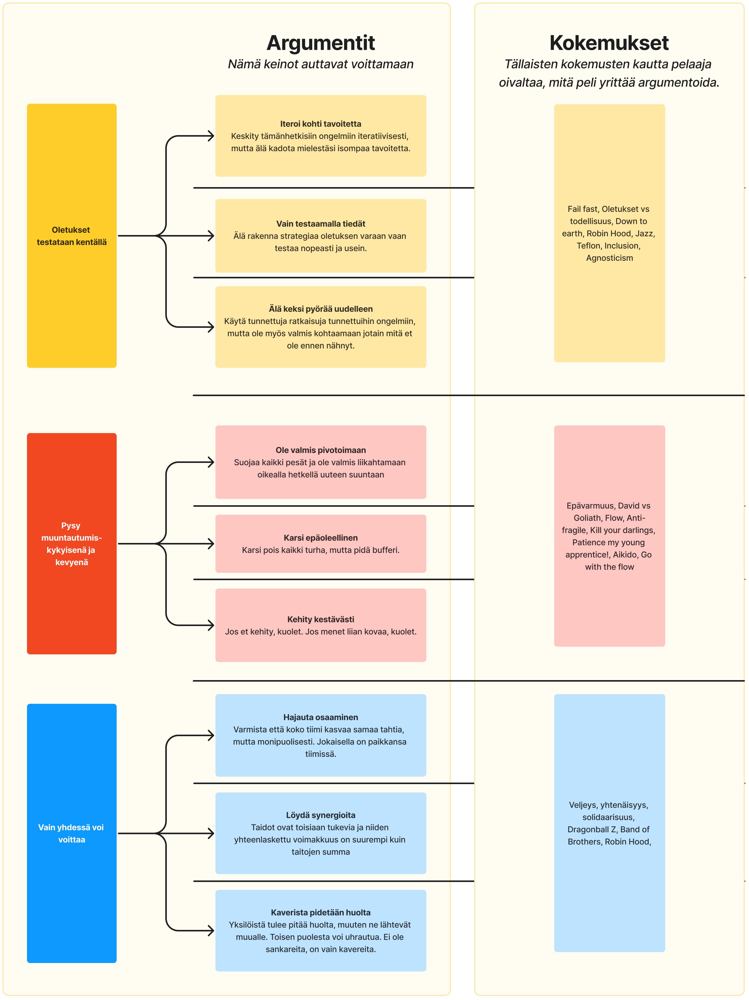
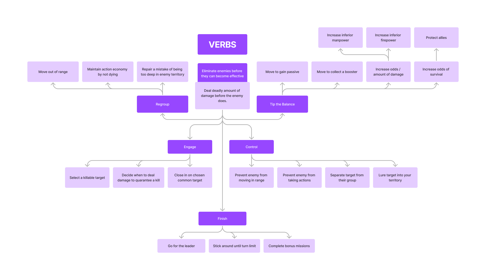

## Arguments
Before designing or developing anything, I wanted to define what type of experience I was looking for. I had recently come up with an alternative approach to MDA[^1] during my graduate thesis and I wanted to give it a shot in a larger project. This involved me making arguments about what the game is about and what sort of approach in playing the game would yield beneficial results. I wager without this step the game would have taken a turn to a more mundane mainstream tactical game. 

 ↑ Early iteration of the arguments work. This document kept evolving until I developed a sixth sense for them and it became redundant. 

As I was still mulling over the topics I covered in my thesis - teaching players how to thrive in complex systems through games (You can read more on that [here](/thesis).) I wanted to see how a video game would respond to this kind of approach. Would I be able to achieve an enjoyable playing experience while also getting my points across to the players through the game?

The chosen three arguments were later translated into two design pillars in terms of the battle feel and play experience: 
1. **Dance with the ever-changing systems**

    This pillar emphasizes the idea that while having a strategic plan is important, the game is designed to encourage adaptability and improvisation. It embraces the concept of "accessible complexity," where players aren't overwhelmed by needing to calculate every possibility. Instead, the game rewards players who can adapt to unexpected situations, creating dramatic moments and close calls. This approach allows for a learning curve where players grow by interacting with the game's systems, learning to "dance" with them rather than trying to dominate them. The design should focus on creating scenarios where players need to continuously reassess and adjust their strategies, maintaining a balance between predictability and surprise.
2. **A unified team of exceptional individuals can achieve victory**

    This pillar underscores the importance of teamwork and coordination for success, while also allowing individual characters to have moments of glory. The game mechanics should be designed to encourage players to utilize the unique strengths of each unit, recognizing and capitalizing on opportunities for exceptional plays. However, an over-reliance on individual action should have its risks, reinforcing the need for teamwork. The loss of any team member should significantly impact the team's effectiveness, highlighting the importance of mutual reliance and the consequences of each character's actions. The design should facilitate moments where individual heroics can turn the tide of battle, but always within the context of a coordinated team effort.

Additionally I defined the mood and type of gameplay these arguments would entail. Since the point was to overwhelm the player with information and let them use and train their intuition to better engage with the enemy I opted for the gameplay to also feature things like "Surviving together against overwhelming odds using unorthodox methods", and instead of going the XCOM route, I opted for more Dungeons and Dragons type of feel, where each individual can shine and take awesome turns while also acting as a coherent team.

## Verbs
At some point of the development I noticed I had difficult time coming up with consistent synergistic abilities. I had spent so much time actually building the system where you can build these abilities etc. that I had forgot what the game was about. The system allowed all sorts of things, but there needed to be some constraints and consistancies across the abilities so they create a unified experience. So I took a long look at the arguments and the feel I wanted to achieve with the game and played the game with existing mechanics as if it was the intended experience. The disparity then informed me what needed fixing. I then created a list of verbs that would drive the sort of experience I was looking for:

These informed me immensely in building a coherent experience, in which all the player systems aligned to achieve certain types of goals in the game and the enemy systems tried to oppose it.

[^1]: MDA, as developed by <a href="https://users.cs.northwestern.edu/~hunicke/MDA.pdf?to=/placeholder.com" target="_blank">Robin Hunicke et al.(2004)</a>