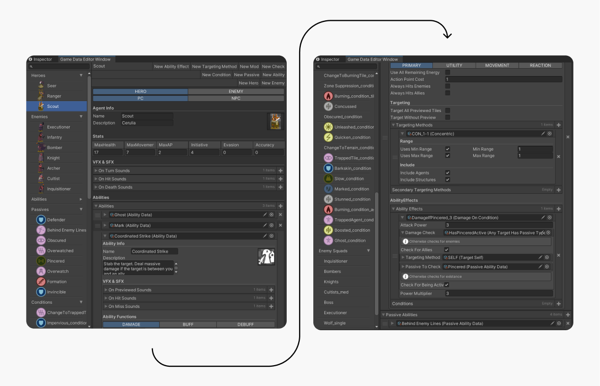

In Book of Ashes, a lot of the fun a interest in multiple playthroughs comes from all the varied content and their differning mechanics: heroes, enemies, abilities, conditions and terrain. I noticed quite early in development to come up with some kind of constraints for all these things so I don't do the classic young solo dev mistake of ballooning my scope and eventually end up giving up on the project. 

## Game Data Editor

So I decided to use potentially consiredable amount of time to just think of the constraints and how they would be formalised into code and further into tools for me as a designer to quickly try out various combinations. The most trouble out of all of these gave the abilities system. It was all over the place and since the game concept kept evolving. So I had to nail down the concept in order to move on. 

Next, I needed to decide on a structure that most if not all abilites would obey when activated. After all was said and done, I had a kind of a Lego system. When an ability was used, it would need to be targeted first. The targeting method (Whether it uses Line Of Sight or something else and how far it can target etc.) and secondary targeting method (for example in the case of an AOE attack) could be assigned from the editor. Then an initial ability effect would take place, for example doing damage or healing. And then there is also a possiblity to leave a more nuanced effect, a condition, on the target, effecting it based on any rules I wanted. Conditions had checks (various methods that would check whether specific game state had been achieved) and modifications (The temporary effects that would take place when a check was triggered. These could be buffs to movement, debuffs to attack power etc.)

This was all arranged via the use of Unity's ScriptableObjects. They enabled me to modularly create plug-and-play conditions and they would work instantly. This allowed me to develop variant of an ability extremely fast. For example, in the demo there are fire users throughout. The abilities they use are basically the same with only slight variations on targeting distance, AOE etc.

 ↑ The Game Data Editor in action. Each element that requires these types of data can be assigned through the editor. They can all be drilled into so the context stays. The editor was adapted from the RPG Editor Odin Inspector provides as a demo of their product. 

## Level Editor

The scope and design of levels went through countless iterations. In the earliest versions I just used a depth-first search algorithm to create random labyrinths and then poked holes in random walls to create somewhat interesting terrain. As it became more and more clear that the game was going to be a tactical RPG rather than an endless maze-runner (see [Early Exporations →](/BOA-early-exploration)) I needed to pay more attention to its crafting. I still played around with the idea of procedural generaion, but those iterations made the levels feel lifeless and didn't provide good tactical experience but more random survival. So I decided to handcraft them. The level size wasn't still decided on (it's still up for debate what is a proper size for a map in this game) but I needed to start somewhere. I saw this awesome and super crappy way of making levels on [YouTube by Brackeys](https://www.youtube.com/watch?v=B_Xp9pt8nRY&t=355s&pp=ygUScGl4ZWwgbGV2ZWwgZWRpdG9y) and decided to give it a try. That version of the level editor was in use quite a while, since the requirements for the levels weren't a priority back then.

 ↑ The Level Editor was basically just a Photoshop file where each individual pixel position and its color corrresponded to a place and entity in the game.

Finally the day came that it mattered. I first shopped around for various external tools such as [Tiled](https://www.mapeditor.org/) or [LDtk by the creator of Dead Cells](https://ldtk.io/), but eventually decided to build my own. The current editor comes with the ability the assign various tile datas to each spot on the grid. I can also quite painlessly change the level size if I need to make that kinds of drastic changes. I can assign markers for various spawnpoints and I will possibly in the future use the marker system to add hazards and various constant area effects. And for easy of use I also added the functionality to toggle the markers since it can get a bit chaotic. If things get more complex, I might add a layer system or a more targeted toggling system.

 ↑ The current level editor is already tearing from the seams. I probably need to add scrolling to the modals. 
