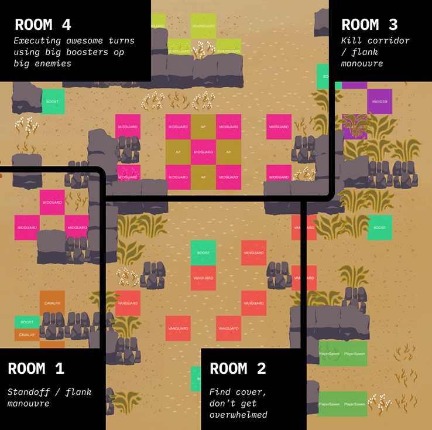

Book of Ashes is a singleplayer tactical RPG / roguelike, where you and you party attempt to slay the long reining phoenix emperor Zeal and their avian minions and bring prosperity back into the region.

<video src="/assets/video/BookOfAshes_trailer.mp4" autoplay loop muted playsinline></video>

<a href="https://drive.google.com/drive/folders/1OuV8T9D9gjhHUOHwY3BP9Brf7KXv9ttm?usp=drive_link" target="_blank">Download demo for Windows or Mac →</a>

## Contributions
During the 9 months I've been developing this game as a solo-project I have among other things:

- Formulated and maintained design vision to steer design and development decisions
- Balanced gameplay elements based on playtesting
- Developed a modular system and tooling for producing content and mechanics fast and reliably
- Designed UI systems to display complex info clearly
- Formalised an art style and produced all art assets
- And much more.

## Design Highlights

 ↑ Some of the heroes in the game. I wanted the heroes and their abilities to produce a feeling of surviving against overwhelming odds by using unorthodox methods. 

 ↑ Military units and spawnpoints. The enemies are positioned in traditional military formations (vanguard etc.), while the player only has three units at their disposal, creating a feeling of overwhelmingly poor odds. The spawnpoints are picked randomly from the available ones based on the needs of the enemy squad. This way a single level can host multiple types of battles. 

 ↑ The levels are conceptually divided into rooms. This allowed me to design room by room in terms of what kinds of encounters they would have while at the same time keeping an eye on the whole.

 ↑ Usual player flows through the level. I wanted the levels to encourage the players to move around the space with their small unit of guerilla fighters, so each room has boosters to encourage moving into them and executing awesome turns.

 ↑ Different tiletypes. Manouvering and altering the battlefield is a crucial aspect of the game. These also affect pathfinding of all agents. For example, they will avoid hazards and difficult terrain unless absolutely necessary. I also added rules for enemies not to stand next to walls or on the edge of the map in order to give the player more opportunities to strike. 

 ↑ Some of the enemies in the game. I wanted each enemy to provide a specific type of challenge. For this battle demo I wanted to highlight the theme of fire in the story and mirror it in the game mechanics. Each enemy group has a progression of difficulties in the enemy units. 

## Further reading
- [Design Pillars of Book of Ashes](/BOA-design-pillars)
- [Content authoring in Book of Ashes](/BOA-tooling)
- [Contextual UI in Book of Ashes](/BOA-UI)
- [Early Exploration work in Book of Ashes](/BOA-early-exploration)