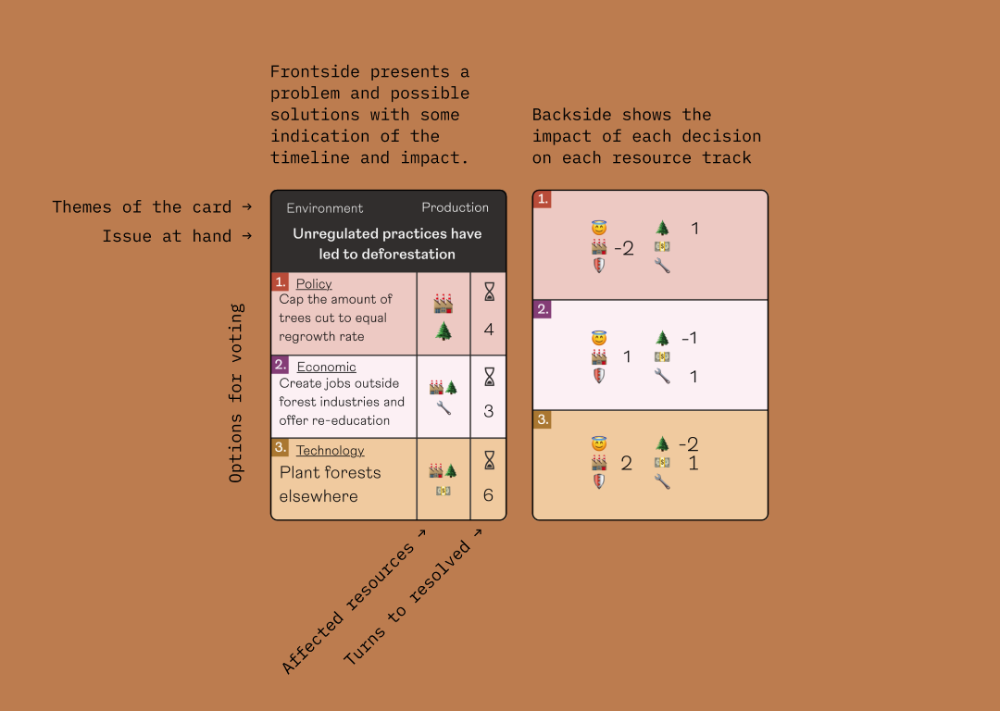
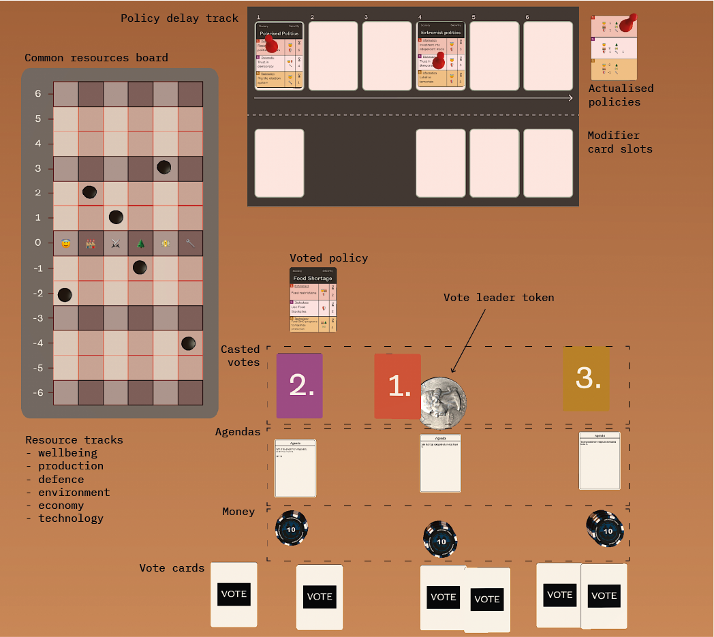
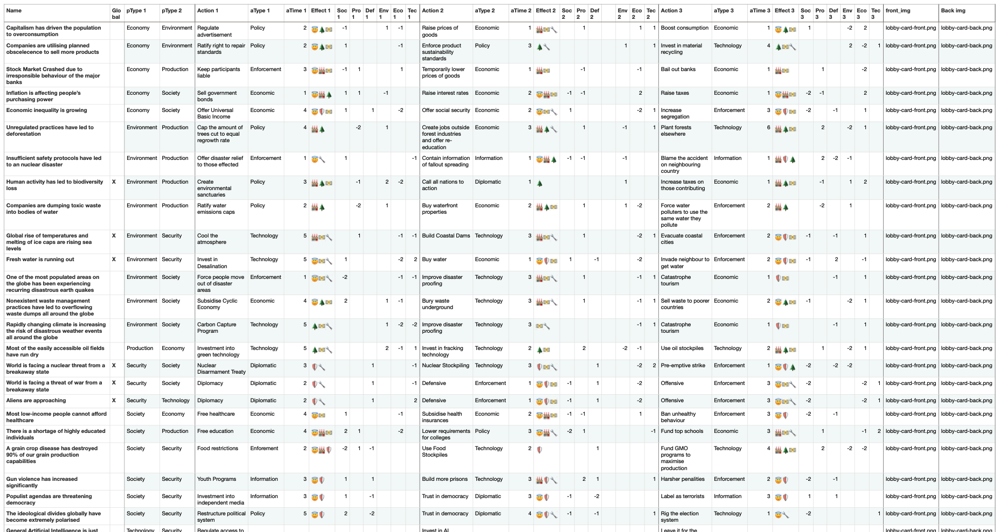

Crisis is a game of negotiation and collaborative resource management. In it, each player is a member of a hegemonic council governing over a large chunk of the planet. Problems are introduced and each member needs to vote on the wanted policy regrading that problem, while also secretly driving their own agenda by buying votes and favors. The player who has most victory points at the end of 10 rounds wins. 

## Contributions
For this proof of concept game I:

- Formulated a high-level design vision based on the aims and hypotheses of my thesis, which this game was a part of
- Researched and narrowed down on a real-world systems that would suit for the purposes of my thesis
- Built fast paper prototypes to narrow down an interesting ruleset
- Designed and balanced cards in spreadsheets that would convey the real-world system dynamics while also staying fun and challenging as a game
- Created prototypes while also playtesting via a workshop method
- Defined and iterated on the ruleset informed by the playtesting data
- And everything else

## Design Highlights

 ↑ The cards contained a lot of information in terms of mechanics, but I also wanted to include quite a bit of story elements into the cards, since my idea was that the cards would also need to be presented by whoever was the leader that turn and argue for their position with whatever knowledge they had. This would result in 1) funny exchanges between players and 2) actual discussion on the morality of the situation. 

 ↑ Here are all components included in the game. 

 ↑ The cards and their values required quite a bit of balancing work since each card could result in three different outcomes. I also took into account that for example truly hideous acts of policymaking such as nuking a neighbouring country that would yield drastic changes on the resource board would also be strongly opposed by the majority of the voters and would require a lot of work to pull off. 

## Further reading

- [Graduate Thesis](/thesis)