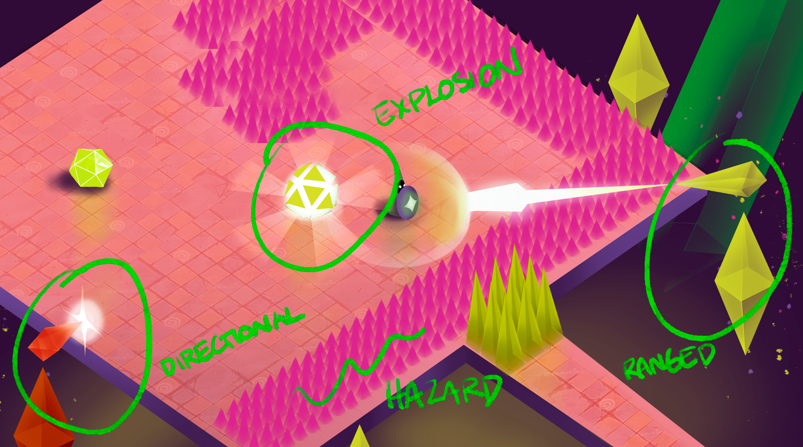

Discordant is a surreal rhythm-action game where you defeat enemies to the beat of the music. Explore the mysterious astral plane and restore the Sun to the dark North.

<video src="/assets/video/Discordant_trailer.mp4" autoplay loop muted playsinline></video>

 ↑ Discordant in action.

<a href="https://drive.google.com/file/d/1pNbVPoUSmdgoKceq_aCguCl8c_r7vAZ0/view?usp=drive_link" target="_blank">Download demo for Windows →</a>

## Contributions
In 2022 I was a part of a 6-member team creating Discordant, a rythm-based bullet hell game. The game was developed over the course of three months as a part of a game project course in Aalto University. My responsibilities included among other things:

- Story conceptualization and thematization of established core mechanics
- Enemy type design
- Level layout design from tutorialization to more challenging levels
- Playtesting and task design
- Art direction to ensure cohesiveness (other team members actually produced the assets)
- Game production

## Design Highlights

 <strong> ↑ Health = progress = difficulty.</strong> Early on we had problems with how to control difficulty in situations where the player is still learning or they just lose their grip on the controller etc. which was pretty common since the game was so fast-paced. I came up with a system of tying player health and progression to the difficulty of each battle. This meant that each player would have to surmount the hardest part of the level in order to progress, acting as a skill-lock, but also acted as a buffer for all the edge-cases mentioned above, because every time you would get hit and lose health, the game would become a bit easier, allowing for regaining control. This feature got a lot of positive feedback in the playtesting sessions both from experienced players as well as novices. 

 <strong> ↑ Different enemy types. </strong> Early on we noticed the need for different kinds of challenges when it came to combining agile movement and managing enemy attacks to the beat. This image I painted was used as a master concept art to derive the rest of the style for the game. We had a lot of talks on the complexity of the music and the needs for the music from gameplay perspective, for example having adaptive music so that we can change the complexity of the track on the fly, and add more of different kinds of enemies.

<!-- [Img of level design]

 ↑ Various levels from the end of the game. In order to ramp up difficulty we wanted the levels themselves also provide a maneovering challenge. This combined with various trap elements meant we had quite a bit of possibilities for scaling the difficulty. A lot of the level layouts were changed in accordance with playtesting data. For example obstacles and chasms were thought of as similar types of challenges, but it turned out a lot of the players got stuck in the obstacle geometry and thus wasn't difficult in a fun sense, so we eliminated a lot of them.
 -->

## Further reading
- [Discordant postmortem](/discordant)