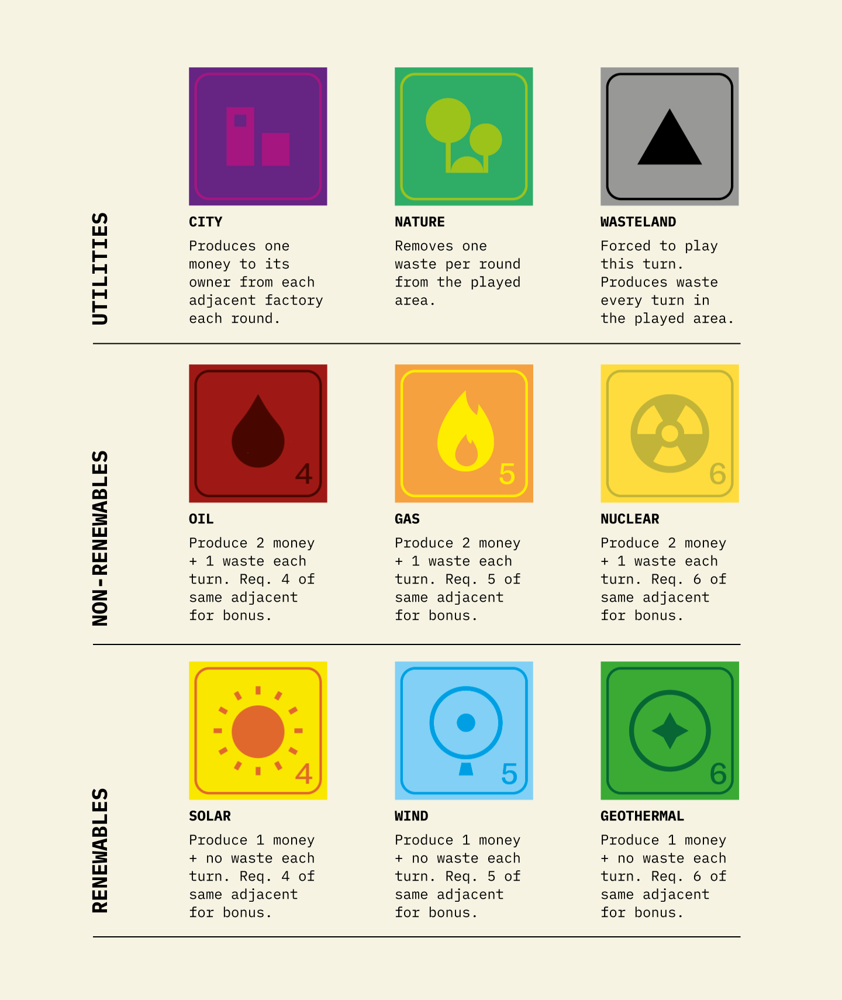
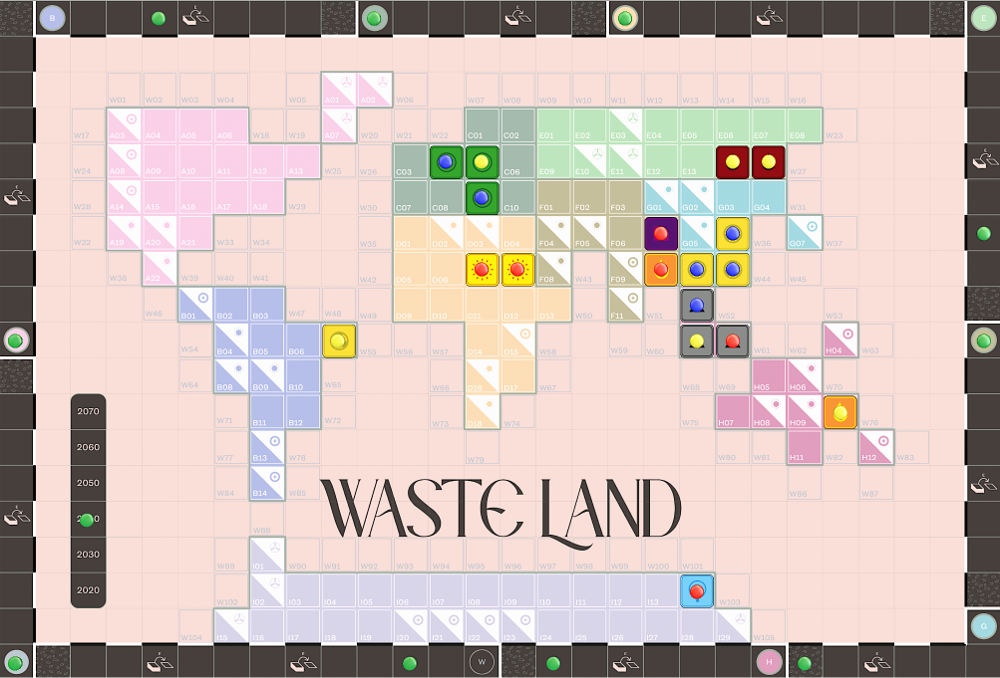

Waste Land is a trading and area-control board game. Players aim to grow their energy empire every turn by trading properties, facilities and money with other players to reach their goals. Every action also manipulates global pool of waste that everyone needs to manage collectively to avoid global ecological collapse, bringing into the game an aspect of shifting loyalties and shift between competition and collaboration. Player with most money at the end of 6 rounds wins.

<video src="/assets/video/Wasteland_trailer.mp4" autoplay loop muted playsinline></video>

 ↑ Playtesting an early prototype.

## Contributions
The game was part of my graduate thesis and while playable, lacks polish and extended features and can be considered more of a proof of concept. For the game I:

- Researched energy and geopolitics and extracted interesting aspects to formulate into game prototypes
- 
- Balanced gameplay mechanics in spreadsheets
- Utilised Tabletop Simulator for remote testing

## Design Highlights

 ↑ The infrastructure cards.

 ↑ The game board.

## Further reading

- [Graduate Thesis](/thesis)